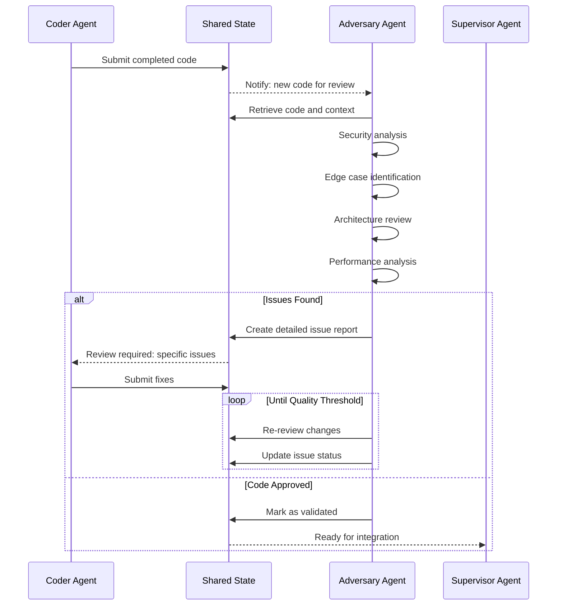

## Problem
AI-generated code often contains subtle bugs, security vulnerabilities, or design issues that the generating agent doesn't catch. Single-agent workflows lack the critical perspective needed to identify problems, leading to lower quality outputs. Traditional static analysis tools catch syntax errors but miss logical flaws, architectural issues, and security concerns that require deeper understanding.

## Solution
Deploy a specialized "Adversary Agent" whose primary role is to challenge, critique, and validate the work of other agents. The APEX pattern implements this through:

- **Adversarial Mindset**: Agent specifically trained/prompted to find problems, edge cases, and vulnerabilities
- **Multi-Perspective Analysis**: Different agent reviews code from security, performance, maintainability angles
- **Systematic Validation**: Structured review process covering code quality, tests, documentation, and architecture
- **Constructive Feedback**: Not just finding problems, but suggesting specific improvements
- **Iterative Improvement**: Creating feedback loops where code is refined based on adversarial findings

Key validation areas:
- **Security Analysis**: Looking for injection attacks, privilege escalation, data leaks
- **Edge Case Testing**: Identifying boundary conditions and error scenarios
- **Architecture Review**: Evaluating design patterns, coupling, and scalability
- **Performance Critique**: Identifying inefficiencies and bottlenecks
- **Code Quality**: Style, readability, maintainability, and best practices

## Example (adversarial validation flow)


## How to use it
- **Specialized Prompting**: Configure adversary agent with security-focused, critical thinking prompts
- **Systematic Checklists**: Provide structured review criteria covering all important aspects
- **Tool Access**: Give adversary appropriate tools for static analysis, testing, and code examination
- **Feedback Templates**: Standardize issue reporting with severity levels and actionable recommendations
- **Integration Points**: Build adversarial review into the standard development workflow

## Adversary Review Checklist Example
```yaml
security_analysis:
  - input_validation: "Check for SQL injection, XSS, command injection"
  - authentication: "Verify proper auth checks and session management"
  - authorization: "Confirm access controls and privilege separation"
  - data_protection: "Review encryption, sanitization, and data handling"

code_quality:
  - error_handling: "Comprehensive error cases and graceful failures"
  - edge_cases: "Boundary conditions, null checks, overflow scenarios"
  - performance: "Inefficient loops, database queries, memory usage"
  - maintainability: "Code clarity, documentation, design patterns"

testing:
  - coverage: "Unit tests for critical functionality"
  - integration: "Component interaction testing"
  - edge_cases: "Tests for error conditions and boundaries"
```

## Trade-offs
- **Pros:**
    - Significantly improves code quality and security posture
    - Catches subtle bugs that automated tools miss
    - Provides diverse perspectives on solutions
    - Creates natural documentation of potential issues
    - Builds robustness through adversarial pressure testing
- **Cons/Considerations:**
    - Increases development time due to review cycles
    - May create tension or conflicts between agents
    - Requires careful balance between criticism and productivity
    - Adversary agent needs specialized training for effective critiques
    - Can become bottleneck if not properly scaled

## References
- Adversary agent implementation in APEX multi-agent architecture
- Code review patterns in `src/apex/supervisor/` components
- Issue tracking and resolution in `src/apex/core/memory.py:MemoryPatterns`
- Git integration for adversarial review workflows
