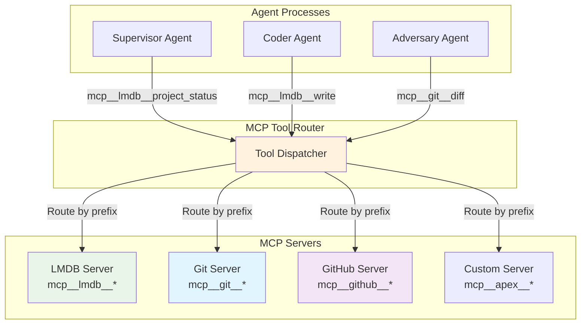

## Problem
When multiple AI agents need to access shared services and tools, there must be a clear way to route tool calls to the appropriate backend services. Without standardized naming and routing, tool conflicts arise, agents may access wrong services, and it becomes difficult to manage permissions and access control across different agent types.

## Solution
Implement a standardized tool naming convention and routing system using the Model Context Protocol (MCP). The APEX pattern establishes:

- **Hierarchical Naming**: Tools follow the pattern `mcp__{serverName}__{toolName}` for clear routing
- **Server Separation**: Different MCP servers handle different concerns (database, git, github, etc.)
- **Permission Boundaries**: Agents get access only to the tools they need via `--allowedTools`
- **Consistent Interfaces**: All tools follow MCP protocol standards for predictable behavior
- **Namespace Isolation**: Server prefixes prevent naming conflicts between different service types

Key routing patterns:
- **Database Operations**: `mcp__lmdb__read`, `mcp__lmdb__write`, `mcp__lmdb__list`
- **Version Control**: `mcp__git__status`, `mcp__git__commit`, `mcp__git__branch`
- **Project Management**: `mcp__lmdb__project_status`, `mcp__lmdb__cursor_scan`
- **Specialized Tools**: Custom tools with clear service boundaries

## Example (tool routing architecture)


## How to use it
- **Establish Naming Convention**: Use consistent `mcp__{server}__{tool}` pattern across all tools
- **Design Service Boundaries**: Group related tools under appropriate server namespaces
- **Configure Permissions**: Use `--allowedTools` to grant specific tool access to each agent type
- **Document Tool Interfaces**: Maintain clear documentation of available tools and their parameters
- **Version Tool APIs**: Use versioning when tool interfaces need to change

## Tool Permission Example
```json
{
  "supervisor_tools": [
    "mcp__lmdb__project_status",
    "mcp__lmdb__write",
    "mcp__lmdb__read",
    "mcp__github__create_pr",
    "mcp__github__create_issue"
  ],
  "coder_tools": [
    "mcp__lmdb__read",
    "mcp__lmdb__write",
    "mcp__git__status",
    "mcp__git__add",
    "mcp__git__commit"
  ],
  "adversary_tools": [
    "mcp__lmdb__read",
    "mcp__git__diff",
    "mcp__git__log",
    "mcp__github__review_pr"
  ]
}
```

## Trade-offs
- **Pros:**
    - Clear separation of concerns and service boundaries
    - Predictable tool routing and conflict resolution
    - Fine-grained permission control per agent type
    - Easy to add new services without naming conflicts
    - Standard MCP protocol ensures interoperability
- **Cons/Considerations:**
    - Verbose tool names due to prefixing requirements
    - Requires careful design of service boundaries
    - Additional complexity in tool registration and routing
    - Need to maintain consistent naming across all services

## References
- MCP tool naming in `src/apex/mcp/claude_lmdb_server.py`
- Tool routing configuration in `configs/lmdb_mcp.json`
- Permission management in Claude CLI `--allowedTools` configuration
- Service boundary design in APEX MCP server implementations
