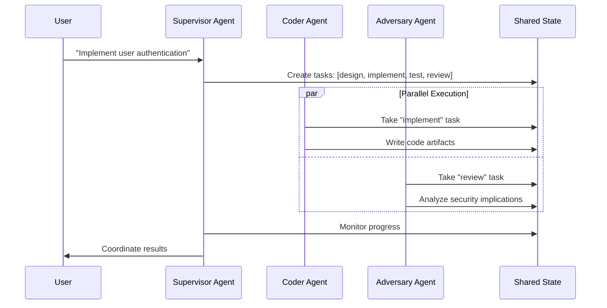

## Problem
Complex software development tasks require diverse skills and perspectives. A single agent may struggle with multifaceted challenges like architectural design, implementation, and adversarial testing. Sequential processing of these concerns can be slow and may miss important interactions between different aspects of the problem.

## Solution
Deploy multiple specialized AI agents, each with distinct roles and capabilities, working on shared tasks through coordinated task distribution. In the APEX pattern:

- **Supervisor Agent**: Orchestrates workflow, creates and assigns tasks, manages project-level decisions
- **Coder Agent**: Focuses on implementation, code generation, and technical execution
- **Adversary Agent**: Performs code review, security analysis, and quality assurance

Key mechanisms:
- **Task Creation**: Supervisor breaks down complex requests into discrete, actionable tasks
- **Task Assignment**: Tasks are distributed based on agent specialization and current workload
- **Parallel Execution**: Multiple agents can work simultaneously on different aspects
- **Cross-Agent Communication**: Agents coordinate through shared state and task dependencies

## Example (flow)

## How to use it
- **Define Agent Roles**: Clearly specify what each agent type is responsible for
- **Task Granularity**: Break work into tasks that can be parallelized effectively
- **Coordination Layer**: Implement shared state mechanism for task distribution and communication
- **Load Balancing**: Monitor agent workloads and redistribute tasks as needed
- **Dependency Management**: Handle task dependencies and sequencing requirements

## Trade-offs
- **Pros:**
    - Leverages specialized capabilities of different agent types
    - Enables parallel processing of complex workflows
    - Provides natural separation of concerns
    - Improves overall system robustness through diverse perspectives
- **Cons/Considerations:**
    - Increased complexity in coordination and communication
    - Potential for conflicts or inconsistencies between agents
    - Requires robust shared state management
    - May have overhead from inter-agent coordination

## References
- APEX (Adversarial Pair EXecution) project architecture
- Task orchestration patterns in `src/apex/supervisor/orchestrator.py`
- Multi-agent coordination via LMDB in `src/apex/core/memory.py`
