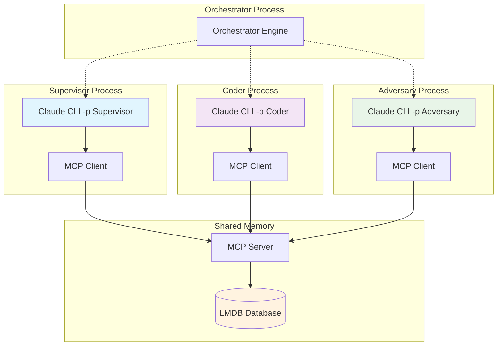

## Problem
Running multiple AI agents in a single process can lead to resource conflicts, memory leaks, and cascading failures. If one agent encounters an error or consumes excessive resources, it can affect all other agents. Additionally, different agents may have different tool requirements or security constraints that are difficult to enforce in a shared process space.

## Solution
Run each AI agent in its own isolated process while providing shared access to common state and resources through a memory-mapped database. The APEX pattern implements this through:

- **Process Per Agent**: Each agent type (Supervisor, Coder, Adversary) runs in a separate `claude -p` process
- **MCP-Based Communication**: Agents communicate through Model Context Protocol (MCP) tools rather than direct process communication
- **Shared Memory Layer**: LMDB provides fast, concurrent access to shared state via memory-mapped files
- **Controlled Tool Access**: Each process gets only the tools and permissions it needs via `--allowedTools`
- **Independent Lifecycles**: Processes can be started, stopped, and restarted independently without affecting others

Key architectural benefits:
- **Fault Isolation**: Agent crashes don't bring down the entire system
- **Resource Containment**: Memory and CPU usage can be monitored and limited per agent
- **Security Boundaries**: Different permission models for different agent types
- **Independent Updates**: Agents can be updated or replaced without system-wide restart

## Example (architecture)

## How to use it
- **Process Management**: Implement robust process spawning, monitoring, and restart logic
- **MCP Configuration**: Set up MCP servers with appropriate tool access for each agent type
- **Shared State Design**: Design memory structures that work efficiently with concurrent access
- **Health Monitoring**: Monitor process health and resource usage independently
- **Graceful Degradation**: Handle individual process failures without stopping the entire system

## Trade-offs
- **Pros:**
    - Strong fault isolation prevents cascading failures
    - Independent resource management and monitoring
    - Security boundaries between different agent types
    - Ability to scale individual agent types independently
    - Memory-mapped shared state provides fast access despite process isolation
- **Cons/Considerations:**
    - Increased complexity in process management and coordination
    - Higher memory overhead due to multiple processes
    - Inter-process communication latency (mitigated by memory-mapped access)
    - More complex debugging across multiple processes

## References
- Process orchestration in `src/apex/supervisor/orchestrator.py`
- MCP server configuration in `configs/lmdb_mcp.json`
- Claude CLI process management with `--output-format stream-json`
- LMDB MCP integration in `src/apex/mcp/claude_lmdb_server.py`
