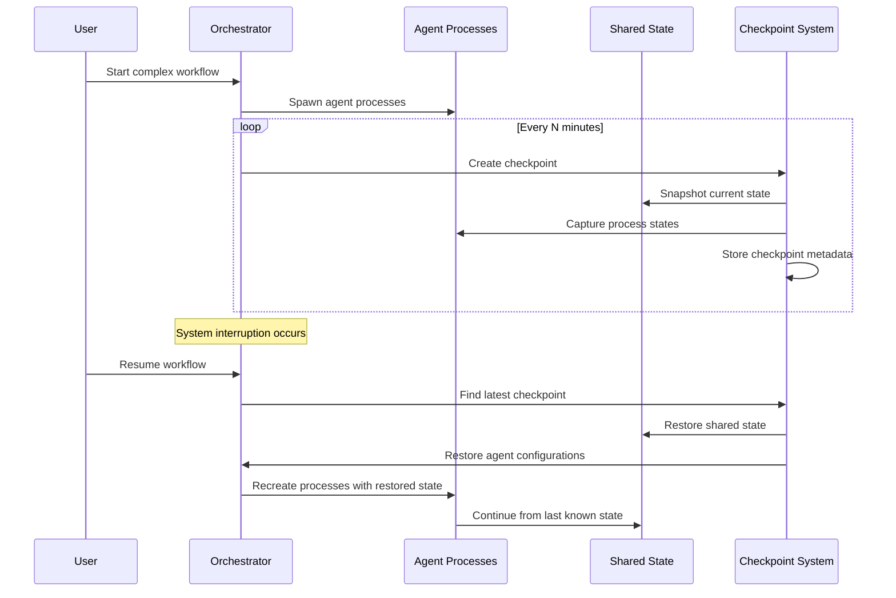

## Problem
Long-running AI agent workflows can be interrupted by system failures, network issues, or planned maintenance. Without proper state management, agents lose context, incomplete work is lost, and complex multi-step processes must restart from the beginning. This is especially problematic for workflows that involve expensive operations or have taken hours to reach their current state.

## Solution
Implement comprehensive checkpoint and recovery mechanisms that capture complete system state at regular intervals and enable seamless restoration. The APEX pattern provides:

- **State Snapshots**: Periodic captures of complete system state including agent states, task progress, and memory contents
- **Event Streams**: Detailed logs of all state changes for point-in-time recovery
- **Process State Capture**: Save agent process configurations and current prompts for exact restoration
- **Incremental Checkpoints**: Efficient storage of only changed data between full snapshots
- **Automated Recovery**: Automatic detection of interruptions and restoration of previous state

Key recovery capabilities:
- **Full Session Restore**: Complete restoration of multi-agent workflow state
- **Selective Recovery**: Restore specific components or timeframes as needed
- **Cross-Platform Recovery**: Resume sessions on different machines or environments
- **Version Compatibility**: Handle checkpoint format evolution across system updates

## Example (checkpoint and recovery flow)


## How to use it
- **Regular Checkpointing**: Schedule automatic checkpoints at reasonable intervals (every 5-10 minutes)
- **State Granularity**: Capture sufficient detail to recreate exact system state
- **Recovery Testing**: Regularly test recovery procedures to ensure they work correctly
- **Checkpoint Cleanup**: Implement retention policies to manage checkpoint storage
- **Failure Detection**: Monitor for interruptions and trigger recovery automatically when appropriate

## Checkpoint Structure Example
```json
{
  "checkpoint_id": "cp_20240115_143022",
  "timestamp": "2024-01-15T14:30:22Z",
  "system_state": {
    "orchestrator": {
      "active_sessions": ["session_123"],
      "configuration": {...}
    },
    "agents": {
      "supervisor": {
        "process_id": "sup_456",
        "current_prompt": "...",
        "state": "planning",
        "last_action": "created_task_789"
      },
      "coder": {
        "process_id": "cod_789",
        "current_prompt": "...",
        "state": "coding",
        "working_on": "task_790"
      }
    },
    "shared_memory": {
      "snapshot_path": "/snapshots/lmdb_20240115_143022.db",
      "keys_modified": ["/projects/proj1/tasks/...", "/projects/proj1/agents/..."]
    }
  },
  "recovery_instructions": {
    "restore_order": ["shared_memory", "orchestrator", "agents"],
    "required_tools": ["claude", "lmdb", "git"],
    "environment_vars": {...}
  }
}
```

## Trade-offs
- **Pros:**
    - Enables interruption-free long-running workflows
    - Protects against data loss from system failures
    - Allows for planned maintenance without workflow disruption
    - Provides audit trail and debugging capabilities
    - Enables experimentation with rollback capabilities
- **Cons/Considerations:**
    - Storage overhead for maintaining checkpoint data
    - Performance impact of regular state capture
    - Complexity in ensuring checkpoint consistency
    - Potential for checkpoint corruption or incompatibility
    - Recovery time proportional to checkpoint size and complexity

## References
- Session management in `src/apex/core/memory.py:MemorySnapshot`
- State persistence patterns in `src/apex/orchestration/state.py`
- Checkpoint creation and restoration logic in memory management components
- Process state capture in orchestrator components
