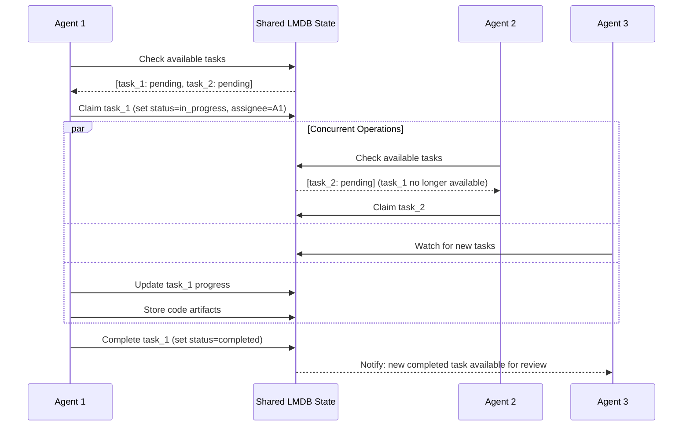

## Problem
Multiple AI agents working on the same project need to coordinate their actions, share information, and maintain consistency. Without a central coordination mechanism, agents may work on conflicting tasks, duplicate effort, or lose important context between operations. Traditional message-passing can be complex and doesn't provide persistence across agent restarts or system failures.

## Solution
Implement a centralized, persistent shared state system that all agents can read from and write to. The APEX pattern uses LMDB (Lightning Memory-Mapped Database) as the coordination hub:

- **Hierarchical Key Structure**: Organize data using a clear namespace hierarchy (`/projects/{id}/agents/`, `/projects/{id}/tasks/`, etc.)
- **Atomic Operations**: Use database transactions to ensure consistency during concurrent access
- **Real-time Watching**: Enable agents to monitor for changes in relevant state areas
- **Structured Data**: Store complex objects as JSON with well-defined schemas
- **Memory-Mapped Performance**: Fast access through memory-mapped files rather than network calls

Key coordination patterns:
- **Task Coordination**: Agents claim tasks by updating their status atomically
- **State Broadcasting**: Changes to shared state are immediately visible to all agents
- **Context Sharing**: Rich project context and history available to all participants
- **Progress Tracking**: Centralized monitoring of project state and agent activities

## Example (coordination flow)

## How to use it
- **Design Clear Schema**: Define hierarchical key structure that naturally separates concerns
- **Use Transactions**: Wrap related operations in atomic transactions to prevent race conditions
- **Implement Watching**: Set up change monitoring for reactive coordination
- **Optimize Access Patterns**: Structure data to minimize contention and maximize cache locality
- **Handle Failure Cases**: Design for agent crashes, partial updates, and recovery scenarios

## Trade-offs
- **Pros:**
    - Strong consistency guarantees through ACID transactions
    - High performance with memory-mapped access
    - Persistence across process restarts and system failures
    - Simple mental model compared to complex message passing
    - Natural audit trail of all coordination activities
- **Cons/Considerations:**
    - Single point of failure (though LMDB is very reliable)
    - Potential performance bottleneck under extreme load
    - Requires careful schema design to avoid lock contention
    - Memory usage grows with state size (though memory-mapped)

## References
- LMDB integration in `src/apex/core/lmdb_mcp.py`
- Memory management patterns in `src/apex/core/memory.py:MemorySchema`
- Shared state orchestration in `src/apex/supervisor/orchestrator.py`
- MCP server implementation in `src/apex/mcp/claude_lmdb_server.py`
