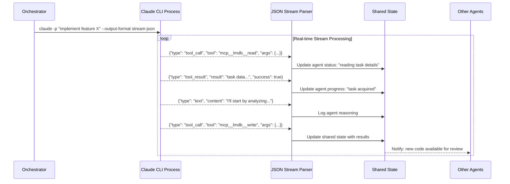

## Problem
Managing multiple AI agent processes requires real-time visibility into their actions, decisions, and state changes. Traditional batch processing or simple stdout monitoring doesn't provide enough granularity to coordinate complex multi-agent workflows. Agents need to react to each other's actions immediately, and orchestrators need detailed insight into tool usage, reasoning steps, and error conditions.

## Solution
Use streaming JSON output format from agent processes to enable real-time parsing and event-driven coordination. The APEX pattern implements this through:

- **Structured Output Stream**: Use `claude --output-format stream-json` for parseable agent output
- **Real-time Event Processing**: Parse JSON events as they occur rather than waiting for completion
- **State Update Triggers**: Use parsed events to update shared state and trigger other agent actions
- **Tool Call Monitoring**: Track individual tool usage, parameters, and results across all agents
- **Error Detection**: Immediate detection of agent errors or unexpected behavior
- **Progress Tracking**: Fine-grained visibility into agent reasoning and decision-making

Key event types:
- **Tool Calls**: When agents invoke tools with parameters and results
- **Text Generation**: Agent reasoning, explanations, and communication
- **State Changes**: Updates to agent internal state or progress
- **Error Events**: Failures, timeouts, or unexpected conditions

## Example (streaming event processing)


## How to use it
- **Stream Parser Setup**: Implement robust JSON stream parsing that handles partial messages and malformed data
- **Event Handler Architecture**: Design event handlers for different message types with appropriate state updates
- **Error Recovery**: Handle stream interruptions, malformed JSON, and process failures gracefully
- **Performance Optimization**: Use efficient parsing and avoid blocking operations in stream handlers
- **Monitoring Integration**: Connect stream events to monitoring systems for visibility and alerting

## JSON Event Schema Example
```json
{
  "timestamp": "2024-01-15T14:30:22.123Z",
  "agent_id": "coder_agent_1",
  "event_type": "tool_call",
  "data": {
    "tool_name": "mcp__lmdb__write",
    "parameters": {
      "key": "/projects/proj1/code/auth.py",
      "value": "# Authentication module..."
    },
    "request_id": "req_789"
  }
}

{
  "timestamp": "2024-01-15T14:30:23.456Z",
  "agent_id": "coder_agent_1",
  "event_type": "tool_result",
  "data": {
    "request_id": "req_789",
    "success": true,
    "result": "File written successfully",
    "execution_time_ms": 45
  }
}

{
  "timestamp": "2024-01-15T14:30:24.789Z",
  "agent_id": "coder_agent_1",
  "event_type": "text",
  "data": {
    "content": "Now I'll create unit tests for the authentication module...",
    "reasoning_step": true
  }
}
```

## Trade-offs
- **Pros:**
    - Real-time visibility into agent actions and reasoning
    - Enables immediate reactive coordination between agents
    - Provides detailed audit trail of all agent activities
    - Allows for fine-grained monitoring and debugging
    - Supports sophisticated orchestration patterns
- **Cons/Considerations:**
    - Increased complexity in stream parsing and event handling
    - Potential performance overhead from real-time processing
    - Requires robust error handling for malformed or incomplete JSON
    - Stream buffering and ordering considerations
    - More complex debugging across multiple concurrent streams

## References
- Claude CLI streaming JSON format: `claude --output-format stream-json`
- Stream parsing implementation in APEX orchestrator components
- Event-driven state updates in `src/apex/supervisor/orchestrator.py`
- Real-time agent coordination patterns in APEX architecture
