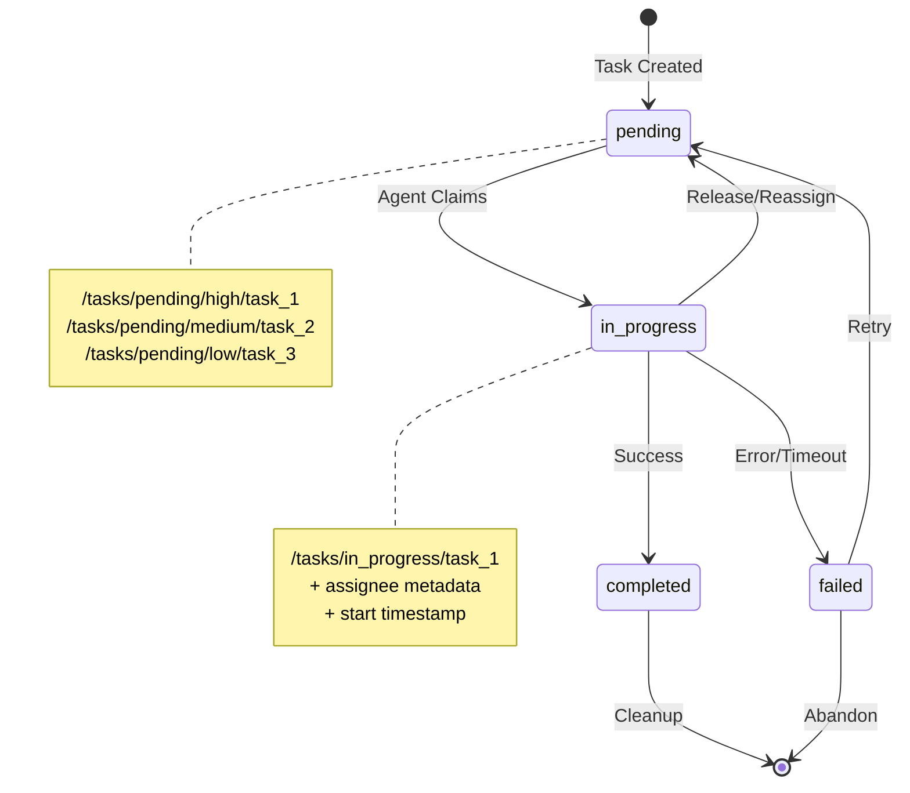

## Problem
Complex projects require breaking work into manageable tasks, tracking their progress, handling dependencies, and coordinating work across multiple agents. Without proper task management, agents may duplicate work, miss dependencies, or lose track of incomplete tasks. Simple task lists don't provide enough structure for sophisticated workflows.

## Solution
Implement a structured task queue system with clear state transitions, priority management, and agent coordination. The APEX pattern organizes tasks through:

- **Hierarchical Task Storage**: Tasks organized by status in LMDB (`/projects/{id}/memory/tasks/{status}/`)
- **State Machine Workflow**: Clear transitions: `pending → in_progress → completed/failed`
- **Priority Queues**: High/medium/low priority tasks within each status category
- **Atomic State Changes**: Use database transactions to prevent race conditions during task claiming
- **Task Dependencies**: Support for prerequisite tasks and sequencing requirements
- **Progress Tracking**: Detailed metadata about task execution and timing

Key workflow patterns:
- **Task Creation**: Supervisor creates tasks with clear descriptions and requirements
- **Task Claiming**: Workers atomically claim pending tasks by moving them to in_progress
- **Progress Updates**: Regular updates to task status and intermediate results
- **Completion Handling**: Automatic cleanup and dependency resolution when tasks complete

## Example (task lifecycle)


## How to use it
- **Task Granularity**: Break work into tasks that can be completed independently in reasonable time
- **Clear Specifications**: Include enough detail for agents to execute tasks without additional context
- **Priority Assignment**: Use priority levels to ensure critical work gets attention first
- **Dependency Tracking**: Model task dependencies to ensure correct execution order
- **Timeout Handling**: Implement timeouts and retry logic for stuck or failed tasks
- **Progress Monitoring**: Regular status updates and progress reporting

## Task Structure Example
```json
{
  "id": "task_123",
  "title": "Implement user authentication endpoint",
  "description": "Create POST /auth/login endpoint with JWT token generation",
  "priority": "high",
  "status": "pending",
  "assignee": null,
  "created_at": "2024-01-15T10:00:00Z",
  "dependencies": ["task_120", "task_121"],
  "metadata": {
    "estimated_effort": "2h",
    "required_tools": ["file_edit", "test_runner"],
    "project_context": "/projects/auth_service"
  }
}
```

## Trade-offs
- **Pros:**
    - Clear visibility into project progress and bottlenecks
    - Prevents duplicate work through atomic task claiming
    - Supports complex workflows with dependencies and priorities
    - Enables efficient work distribution across multiple agents
    - Provides audit trail of all task state changes
- **Cons/Considerations:**
    - Overhead of task management for simple workflows
    - Requires careful design of task granularity and dependencies
    - May create contention if many agents compete for same tasks
    - Complex dependency chains can create deadlocks if not managed carefully

## References
- Task workflow implementation in `src/apex/core/memory.py:MemoryPatterns`
- Task queue management in `src/apex/supervisor/orchestrator.py`
- LMDB task storage schema in `src/apex/core/memory.py:MemorySchema`
- TaskBriefing distribution system in supervisor components
