## **APEX Functional Specification v2.0: The Orchestrator-Worker Architecture**

```
 █████╗ ██████╗ ███████╗██╗  ██╗
██╔══██╗██╔══██╗██╔════╝╚██╗██╔╝
███████║██████╔╝█████╗   ╚███╔╝
██╔══██║██╔═══╝ ██╔══╝   ██╔██╗
██║  ██║██║     ███████╗██╔╝ ██╗
╚═╝  ╚═╝╚═╝     ╚══════╝╚═╝  ╚═╝
Adversarial Pair EXecution v2.0
The Orchestrator-Worker Architecture
```

## Table of Contents

1. [Introduction: A New Paradigm for AI Development](#1-introduction-a-new-paradigm-for-ai-development)
2. [Core Architectural Principles](#2-core-architectural-principles)
3. [System Components](#3-system-components)
4. [The Core Orchestration Loop](#4-the-core-orchestration-loop)
5. [Component Deep Dive](#5-component-deep-dive)
6. [The TaskBriefing: Our Core API Contract](#6-the-taskbriefing-our-core-api-contract)
7. [Implementation Roadmap](#7-implementation-roadmap)

## 1. Introduction: A New Paradigm for AI Development

Welcome to APEX. To understand this project, it's essential to discard the common metaphor of "AI agents as a team of colleagues." While that model is useful for simple demonstrations, it's inefficient, costly, and fragile in practice.

Instead, imagine a master artisan at their workbench. The artisan (`The Supervisor`) is the sole creative force, holding the entire vision for the project. The workbench is our shared memory (`LMDB`). On the wall are highly specialized, magical tools (`Workers` and `Utilities`). When the artisan needs to carve a complex piece, they pick up the "sentient chisel" (`Coder Worker`), give it a precise instruction, and it performs the intricate work. When they need to sand the wood, they use a simple, deterministic "power sander" (`Utility`). The artisan directs everything, but never does the manual labor.

**This is the APEX philosophy.** We are building a system with a single, persistent, intelligent **Orchestrator** (the `Supervisor`) that invokes **ephemeral, specialized workers** to perform tasks. This architecture is designed for maximum control, efficiency, and transparency. A new developer on this project is not joining a team of three agents; they are building the intelligent workbench and the magical tools for our master artisan, the `Supervisor`.

## 2. Core Architectural Principles

Every design decision in APEX must align with these four principles:

1.  **Orchestration over Emulation:** We do not emulate a human team. We build an AI-native control plane where a central intelligence directs specialized executors. This is more efficient and less prone to the "emergent chaos" of multi-agent conversations.
2.  **Intelligent Dispatch:** The `Supervisor` is a smart dispatcher. It must know when a task requires creative reasoning (and invoke an expensive, intelligent `Worker`) versus when it needs a reliable, deterministic action (and invoke a cheap, fast `Utility`).
3.  **Context-as-a-Service (The LMDB Moat):** The LLM's context window is a precious, expensive resource. We protect it fiercely. Large data blobs (files, logs, web pages) *never* enter the main agent's context. Instead, they are stored in our `LMDB` database, and agents operate on *pointers* (keys) to this data. This is our core technical advantage.
4.  **Tiered Execution & Security:** The system is built in layers of trust and capability. The `Supervisor` has the highest-level view. `Intelligent Workers` are sandboxed and can only interact with the world via the `MCP Server`. `Deterministic Utilities` have more direct system access but are not creative, minimizing risk.

## 3. System Components

The APEX system consists of three distinct tiers of execution, all coordinated around a central "world state."

```mermaid
graph TD
    subgraph "APEX System"
        User -- Chat/Commands --> TUI
        TUI -- User Input --> Supervisor

        subgraph "Tier 1: Persistent Meta-Agent"
            style Supervisor fill:#d1c4e9,stroke:#333,stroke-width:2px
            Supervisor(🧠 Supervisor Agent via `claude` CLI)
        end

        subgraph "Tier 2: Ephemeral Intelligent Workers"
            style Coder fill:#e3f2fd,stroke:#333
            style Adversary fill:#ffebee,stroke:#333
            Coder(💻 Coder Worker via `claude` CLI)
            Adversary(🛡️ Adversary Worker via `claude` CLI)
        end

        subgraph "Tier 3: Deterministic System Utilities"
            style Archivist fill:#e8f5e9,stroke:#333
            Archivist(📜 Archivist via `python`)
        end

        WorldState["🗄️ World State (LMDB)"]
        MCP_Server(🌐 MCP Server)

        Supervisor -- "1. Plan & Invoke" --> Coder
        Supervisor -- "1. Plan & Invoke" --> Adversary
        Coder -- "2. Read/Write State" --> MCP_Server
        Adversary -- "2. Read/Write State" --> MCP_Server
        MCP_Server -- "3. Access" --> WorldState

        Supervisor -- "4. Invoke Utility" --> Archivist
        Archivist -- "5. Direct Read/Write" --> WorldState
        Archivist -- "6. External API Call" --> Anthropic_API[☁️ LLM API]
    end
```



## 4. The Core Orchestration Loop

The `Supervisor` is the engine of APEX. Its operation follows a continuous, five-stage loop for every task it undertakes:

1.  **PLAN:** Based on the user's high-level goal, the `Supervisor` breaks the work down into a directed graph of discrete, single-responsibility tasks. It determines the correct `Worker` or `Utility` for each task.
2.  **CONSTRUCT BRIEFING:** For a task requiring an `Intelligent Worker`, the `Supervisor` creates a `TaskBriefing` document in LMDB. This briefing is the complete, self-contained work order, containing the objective and pointers to all necessary context within LMDB.
3.  **INVOKE:** The `Supervisor` spawns the appropriate executor:
    *   For an `Intelligent Worker`, it runs a `claude` CLI command with a minimal, static prompt that simply points the worker to its `TaskBriefing` key in LMDB.
    *   For a `Deterministic Utility`, it runs a `python` script with command-line arguments.
4.  **MONITOR:** The `Supervisor` captures the `stdout` of the invoked process in real-time. For `Workers`, this is the `stream-json` feed, which is parsed and logged to provide a live, transparent audit trail of the worker's "thoughts" and actions.
5.  **INTEGRATE:** Once the ephemeral process exits, the `Supervisor` inspects the deliverables (new LMDB keys, files, etc.). It validates the output, integrates the results into the main project state, updates its plan, and proceeds to the next task.

## 5. Component Deep Dive

### 5.1 The `Supervisor` (Persistent Meta-Agent)

*   **What it is:** The single, long-running process that manages the entire project lifecycle. It is the only component the user directly interacts with.
*   **Implementation:** A Python process that orchestrates `claude` CLI sub-processes. Its own reasoning is powered by a high-capability model (e.g., Claude 3.5 Sonnet).
*   **Responsibilities:**
    *   Interpreting user commands from the TUI.
    *   Maintaining the high-level project plan and task graph.
    *   Constructing `TaskBriefing` documents for workers.
    *   Dispatching tasks to the correct `Worker` or `Utility`.
    *   Managing the overall state of the `LMDB World State`.
    *   Reporting progress and results back to the user in the TUI.

### 5.2 `Coder` & `Adversary` (Ephemeral Intelligent Workers)

*   **What they are:** Temporary, single-use `claude` CLI processes invoked by the `Supervisor` to perform complex, creative, or reasoning-intensive tasks. They are "born" for a single task and "die" upon its completion.
*   **Implementation:** A standard `claude` CLI invocation.
    ```bash
    # Supervisor invokes the Coder for task-007
    claude \
      -p "You are an expert CODER agent. Your mission is to execute a single, well-defined task. Read your complete briefing from the APEX shared memory at LMDB key '/tasks/briefings/task-007' using the 'mcp__lmdb__read' tool. Follow the instructions precisely. Place your deliverables in the specified output keys. Announce 'TASK COMPLETE' when finished." \
      --output-format stream-json
    ```
*   **Key Characteristics:**
    *   **Stateless:** They have no memory of past tasks. All context comes from the `TaskBriefing`.
    *   **Sandboxed:** Their only "view" of the world is through the tools exposed by the `MCP Server`. They cannot access the file system or external APIs directly.
    *   **Efficient:** The invocation prompt is tiny. The heavy context lives in LMDB, saving significant token costs on every call.

### 5.3 `Archivist` & other Utilities (Deterministic System Utilities)

*   **What they are:** Plain Python scripts that perform specific, predictable, non-reasoning tasks. They are the "power tools" of the `Supervisor`.
*   **Implementation:** A Python script run via a sub-process, with arguments supplied by the `Supervisor`.

    ```python
    # A simplified view of apex/tools/archivist.py
    import anthropic, lmdb, argparse

    def run_archivist(source_key, target_key, model):
        # 1. Connect directly to LMDB
        db_env = lmdb.open(os.environ["APEX_LMDB_PATH"])
        content = db_env.get(source_key.encode())

        # 2. Call the LLM API directly for a specific task
        client = anthropic.Anthropic()
        message = client.messages.create(
            model=model,
            system="You are an Archivist. Summarize the following content.",
            messages=[{"role": "user", "content": content.decode()}]
        )
        summary = message.content[0].text

        # 3. Write the result directly back to LMDB
        db_env.put(target_key.encode(), summary.encode())
        print(f"Summary saved to {target_key}")

    # ... main function with argparse ...
    ```
*   **Key Characteristics:**
    *   **Deterministic & Reliable:** They perform their task the same way every time.
    *   **Privileged Access:** They have direct access to the system (LMDB, file system, APIs) as needed. This is safe because their logic is hard-coded and not subject to LLM "hallucinations."
    *   **Fast & Cheap:** They avoid the overhead of a full `claude` CLI session and can use cheaper, faster models for tasks like summarization.

## 6. The `TaskBriefing`: Our Core API Contract

The `TaskBriefing` is the most critical data structure in APEX. It is the well-defined API contract between the `Supervisor` and its `Intelligent Workers`.

**Location:** `/tasks/briefings/<task_id>`
**Format:** JSON

```json
{
  "task_id": "coder-20240625-007",
  "role_required": "Coder", // "Coder" or "Adversary"
  "objective": "Implement the user login endpoint, including password verification and JWT generation, based on the approved schema.",

  // Pointers to relevant information within LMDB. The worker will read these.
  "context_pointers": {
    "approved_schema": "/memory/artifacts/auth_schema_v2.json",
    "coding_standards": "/docs/style_guide.md",
    "related_feature_summary": "/summaries/features/registration.md"
  },

  // A list of required outputs. The worker MUST create these keys.
  "deliverables": [
    {
      "type": "code",
      "description": "The main Python file for the login endpoint.",
      "output_key": "/tasks/outputs/task-007/code/login_endpoint.py"
    },
    {
      "type": "unit_test",
      "description": "The pytest file to validate the login endpoint.",
      "output_key": "/tasks/outputs/task-007/tests/test_login.py"
    },
    {
      "type": "status_report",
      "description": "A brief report on implementation choices and potential issues.",
      "output_key": "/tasks/outputs/task-007/report.md"
    }
  ],

  "status": "pending_invocation" // Managed by the Supervisor
}
```

## 7. Implementation Roadmap

This project should be built in three logical phases to ensure a solid foundation.

**Phase 1: The Foundation - The Supervisor & The World State**
1.  **Implement the Core LMDB Client & MCP Server:** Establish the central nervous system.
2.  **Develop the `Supervisor` Orchestration Engine:** Build the main loop and the process manager for invoking workers/utilities.
3.  **Build the TUI "Control Panel":** Create the user's window into the `Supervisor`'s mind, focusing on the chat pane and the live plan view.

**Phase 2: The Intelligent Workforce**
1.  **Finalize the `TaskBriefing` Schema:** Solidify the API contract.
2.  **Implement the `Coder` Worker Flow:** Teach the `Supervisor` how to generate coding briefings and integrate the results.
3.  **Implement the `Adversary` Worker Flow:** Teach the `Supervisor` how to generate review briefings and handle the feedback loop.

**Phase 3: The Toolkit & Optimization**
1.  **Create the `apex.tools` Module:** Set up the directory for deterministic utilities.
2.  **Implement the `Archivist` Utility:** Build our first deterministic utility as a proof-of-concept for direct API calls and DB access.
3.  **Expand the Toolkit:** Begin developing other key utilities like a `TestRunner` and `GitManager` to further offload deterministic work from the LLM agents.

---

## Current Implementation Status

Based on the codebase analysis, the current APEX implementation provides an excellent foundation for the v2.0 architecture:

### ✅ **Strong Alignment - Ready to Extend**
- **Memory Management System**: Comprehensive LMDB patterns with schemas, snapshots, and cleanup
- **Process Management**: Robust Claude CLI process spawning and monitoring
- **MCP Integration**: FastMCP-based LMDB server with comprehensive tool suite
- **Agent System**: Well-designed specialization framework with role-based prompts

### 🔄 **Partial Alignment - Needs Refactoring**
- **Orchestration Engine**: Needs enhancement for task graph execution and distributed coordination
- **Session Management**: Requires multi-session support and resource isolation
- **Event System**: Needs expansion to distributed event routing and sourcing
- **CLI Interface**: Requires cluster management and multi-node capabilities

### 🆕 **Missing Components - New Development**
- **Distributed Task Queue**: Priority-based task scheduling with dependencies
- **Resource Management**: Auto-scaling and resource pool management
- **Multi-Node Coordination**: Distributed consensus and node discovery
- **Advanced Monitoring**: Production-grade metrics, tracing, and dashboards
- **Security & Multi-Tenancy**: Enterprise authentication and project isolation

## Migration Strategy

The current codebase provides strong foundations that can be enhanced rather than rebuilt. The key is to:

1. **Leverage existing strengths**: Memory patterns, process management, MCP integration
2. **Refactor orchestration**: Transform from simple workflow to intelligent task dispatch
3. **Add missing components**: Build distributed coordination and enterprise features
4. **Maintain compatibility**: Ensure existing functionality continues working during transition

This v2.0 specification provides a clear path forward while preserving the significant investment in the current well-designed architecture.
