## **APEX Functional Specification v2.0: The Orchestrator-Worker Architecture**

```
 █████╗ ██████╗ ███████╗██╗  ██╗
██╔══██╗██╔══██╗██╔════╝╚██╗██╔╝
███████║██████╔╝█████╗   ╚███╔╝
██╔══██║██╔═══╝ ██╔══╝   ██╔██╗
██║  ██║██║     ███████╗██╔╝ ██╗
╚═╝  ╚═╝╚═╝     ╚══════╝╚═╝  ╚═╝
Adversarial Pair EXecution v2.0
The Orchestrator-Worker Architecture
```

## Table of Contents

1. [Introduction: Simple, Effective AI Orchestration](#1-introduction-simple-effective-ai-orchestration)
2. [Core Architectural Principles](#2-core-architectural-principles)
3. [System Components](#3-system-components)
4. [The Core Orchestration Loop](#4-the-core-orchestration-loop)
5. [Component Deep Dive](#5-component-deep-dive)
6. [Simplified Implementation](#6-simplified-implementation)
7. [Implementation Status](#7-implementation-status)

## 1. Introduction: Simple, Effective AI Orchestration

APEX v2.0 implements a **simplified Orchestrator-Worker architecture** that focuses on practical AI development automation. Instead of complex multi-agent conversations, APEX uses a single intelligent **Supervisor** that breaks down goals into discrete tasks and orchestrates **ephemeral Workers** to execute them.

**Key Benefits:**
- **Simple but Powerful**: 3-5 task workflows instead of complex dependency graphs
- **Cost Effective**: Workers are spawned only when needed and terminated after completion
- **Transparent**: Full audit trail of all orchestration decisions and task execution
- **Reliable**: Deterministic task planning with well-defined dependencies

**The APEX Philosophy:** One persistent orchestrator managing ephemeral, specialized workers through a shared memory system. This creates maximum control and efficiency while remaining simple to understand and maintain.

## 2. Core Architectural Principles

Every design decision in APEX must align with these four principles:

1.  **Orchestration over Emulation:** We do not emulate a human team. We build an AI-native control plane where a central intelligence directs specialized executors. This is more efficient and less prone to the "emergent chaos" of multi-agent conversations.
2.  **Intelligent Dispatch:** The `Supervisor` is a smart dispatcher. It must know when a task requires creative reasoning (and invoke an expensive, intelligent `Worker`) versus when it needs a reliable, deterministic action (and invoke a cheap, fast `Utility`).
3.  **Context-as-a-Service (The LMDB Moat):** The LLM's context window is a precious, expensive resource. We protect it fiercely. Large data blobs (files, logs, web pages) *never* enter the main agent's context. Instead, they are stored in our `LMDB` database, and agents operate on *pointers* (keys) to this data. This is our core technical advantage.
4.  **Tiered Execution & Security:** The system is built in layers of trust and capability. The `Supervisor` has the highest-level view. `Intelligent Workers` are sandboxed and can only interact with the world via the `MCP Server`. `Deterministic Utilities` have more direct system access but are not creative, minimizing risk.

## 3. System Components

The APEX system consists of three distinct tiers of execution, all coordinated around a central "world state."

```mermaid
graph TD
    subgraph "APEX System"
        User -- Chat/Commands --> TUI
        TUI -- User Input --> Supervisor

        subgraph "Tier 1: Persistent Meta-Agent"
            style Supervisor fill:#d1c4e9,stroke:#333,stroke-width:2px
            Supervisor(🧠 Supervisor Agent via `claude` CLI)
        end

        subgraph "Tier 2: Ephemeral Intelligent Workers"
            style Coder fill:#e3f2fd,stroke:#333
            style Adversary fill:#ffebee,stroke:#333
            Coder(💻 Coder Worker via `claude` CLI)
            Adversary(🛡️ Adversary Worker via `claude` CLI)
        end

        subgraph "Tier 3: Deterministic System Utilities"
            style Archivist fill:#e8f5e9,stroke:#333
            Archivist(📜 Archivist via `python`)
        end

        WorldState["🗄️ World State (LMDB)"]
        MCP_Server(🌐 MCP Server)

        Supervisor -- "1. Plan & Invoke" --> Coder
        Supervisor -- "1. Plan & Invoke" --> Adversary
        Coder -- "2. Read/Write State" --> MCP_Server
        Adversary -- "2. Read/Write State" --> MCP_Server
        MCP_Server -- "3. Access" --> WorldState

        Supervisor -- "4. Invoke Utility" --> Archivist
        Archivist -- "5. Direct Read/Write" --> WorldState
        Archivist -- "6. External API Call" --> Anthropic_API[☁️ LLM API]
    end
```



## 4. The Core Orchestration Loop

The `Supervisor` is the engine of APEX. Its operation follows a continuous, five-stage loop for every task it undertakes:

1.  **PLAN:** The `Supervisor` analyzes the user's goal and creates a simple task sequence (3-5 tasks) using template-based logic:
    - **Implementation goals** → Research → Implement → Test
    - **Bug fix goals** → Investigate → Fix → Verify
    - **Generic goals** → Analyze → Implement → Review

2.  **CONSTRUCT:** For each task, the `Supervisor` creates a `TaskBriefing` with:
    - Clear objective and role assignment (Coder or Adversary)
    - Context pointers to relevant LMDB data
    - Required deliverable specifications
    - Quality criteria for completion

3.  **INVOKE:** The `Supervisor` spawns Claude CLI workers with minimal prompts:
    ```bash
    claude -p "You are a {role} worker. Read your briefing from LMDB key {briefing_key} and complete the task."
    ```

4.  **MONITOR:** Real-time monitoring of worker stdout/stderr with stream-json parsing for transparency.

5.  **INTEGRATE:** Validate deliverables, mark tasks complete, and proceed to the next task in sequence.

## 5. Component Deep Dive

### 5.1 The `Supervisor` (Persistent Meta-Agent)

*   **What it is:** The single, long-running process that manages the entire project lifecycle. It is the only component the user directly interacts with.
*   **Implementation:** A Python process that orchestrates `claude` CLI sub-processes. Its own reasoning is powered by a high-capability model (e.g., Claude 3.5 Sonnet).
*   **Responsibilities:**
    *   Interpreting user commands from the TUI.
    *   Maintaining the high-level project plan and task graph.
    *   Constructing `TaskBriefing` documents for workers.
    *   Dispatching tasks to the correct `Worker` or `Utility`.
    *   Managing the overall state of the `LMDB World State`.
    *   Reporting progress and results back to the user in the TUI.

### 5.2 `Coder` & `Adversary` (Ephemeral Intelligent Workers)

*   **What they are:** Temporary, single-use `claude` CLI processes invoked by the `Supervisor` to perform complex, creative, or reasoning-intensive tasks. They are "born" for a single task and "die" upon its completion.
*   **Implementation:** A standard `claude` CLI invocation.
    ```bash
    # Supervisor invokes the Coder for task-007
    claude \
      -p "You are an expert CODER agent. Your mission is to execute a single, well-defined task. Read your complete briefing from the APEX shared memory at LMDB key '/tasks/briefings/task-007' using the 'mcp__lmdb__read' tool. Follow the instructions precisely. Place your deliverables in the specified output keys. Announce 'TASK COMPLETE' when finished." \
      --output-format stream-json
    ```
*   **Key Characteristics:**
    *   **Stateless:** They have no memory of past tasks. All context comes from the `TaskBriefing`.
    *   **Sandboxed:** Their only "view" of the world is through the tools exposed by the `MCP Server`. They cannot access the file system or external APIs directly.
    *   **Efficient:** The invocation prompt is tiny. The heavy context lives in LMDB, saving significant token costs on every call.

### 5.3 `Archivist` & other Utilities (Deterministic System Utilities)

*   **What they are:** Plain Python scripts that perform specific, predictable, non-reasoning tasks. They are the "power tools" of the `Supervisor`.
*   **Implementation:** A Python script run via a sub-process, with arguments supplied by the `Supervisor`.

    ```python
    # A simplified view of apex/tools/archivist.py
    import anthropic, lmdb, argparse

    def run_archivist(source_key, target_key, model):
        # 1. Connect directly to LMDB
        db_env = lmdb.open(os.environ["APEX_LMDB_PATH"])
        content = db_env.get(source_key.encode())

        # 2. Call the LLM API directly for a specific task
        client = anthropic.Anthropic()
        message = client.messages.create(
            model=model,
            system="You are an Archivist. Summarize the following content.",
            messages=[{"role": "user", "content": content.decode()}]
        )
        summary = message.content[0].text

        # 3. Write the result directly back to LMDB
        db_env.put(target_key.encode(), summary.encode())
        print(f"Summary saved to {target_key}")

    # ... main function with argparse ...
    ```
*   **Key Characteristics:**
    *   **Deterministic & Reliable:** They perform their task the same way every time.
    *   **Privileged Access:** They have direct access to the system (LMDB, file system, APIs) as needed. This is safe because their logic is hard-coded and not subject to LLM "hallucinations."
    *   **Fast & Cheap:** They avoid the overhead of a full `claude` CLI session and can use cheaper, faster models for tasks like summarization.

## 6. Simplified Implementation

### TaskBriefing Structure

The `TaskBriefing` serves as the communication protocol between Supervisor and Workers:

```json
{
  "task_id": "task-20250625-1400-implement",
  "role_required": "Coder",
  "objective": "Implement user authentication system",
  "priority": "high",
  "context_pointers": {
    "project_config": "/projects/proj-001/config",
    "coding_standards": "/projects/proj-001/docs/coding_standards.md"
  },
  "deliverables": [
    {
      "type": "code",
      "description": "Authentication implementation",
      "output_key": "/tasks/outputs/task-001/code/",
      "required": true
    }
  ],
  "dependencies": ["task-20250625-1400-research"],
  "estimated_duration": 90,
  "status": "pending"
}
```

### Simple Task Templates

**Implementation Tasks**: Research → Implement → Test
```
1. Research and plan approach (Coder, 30min)
2. Implement core functionality (Coder, 90min)
3. Test and validate implementation (Adversary, 45min)
```

**Bug Fix Tasks**: Investigate → Fix → Verify
```
1. Investigate and reproduce issue (Adversary, 30min)
2. Implement fix (Coder, 60min)
3. Verify fix and test for regressions (Adversary, 30min)
```

### Worker Communication

Workers receive minimal prompts:
```bash
claude -p "You are a {role} worker. Read your briefing from LMDB key {briefing_key} using mcp__lmdb__read. Complete the task and output deliverables to the specified keys."
```

This simplified approach provides:
- **Clarity**: Each task has a single, well-defined purpose
- **Reliability**: Sequential execution eliminates complex dependency issues
- **Efficiency**: Template-based planning reduces token usage
- **Maintainability**: Simple logic is easier to debug and extend

## 7. Implementation Status

**✅ COMPLETED (v2.0 Simplified)**

**Phase 1: Core Foundation**
- ✅ **SupervisorEngine**: 5-stage orchestration loop with simplified planning
- ✅ **TaskPlanner**: Template-based task creation (implementation, bug fix, generic)
- ✅ **BriefingGenerator**: Complete TaskBriefing creation with context collection
- ✅ **ProcessOrchestrator**: Claude CLI worker spawning and monitoring
- ✅ **LMDB Memory System**: Comprehensive shared memory with MCP integration
- ✅ **TaskBriefing Schema**: Complete Pydantic v2 validation system

**Phase 2: Working System**
- ✅ **End-to-End Orchestration**: Goal → Tasks → Workers → Results
- ✅ **Simple CLI Interface**: `apex start <goal>` for immediate orchestration
- ✅ **Task Dependencies**: Sequential execution with proper dependency handling
- ✅ **Worker Communication**: Claude CLI processes with TaskBriefing consumption

**🎯 NEXT STEPS (Optional Enhancements)**
- **TUI Integration**: Connect SupervisorEngine to visual interface
- **Utilities Framework**: Add deterministic tools for common operations
- **Advanced Planning**: More sophisticated task decomposition
- **Multi-project Support**: Project isolation and management

**🚀 QUICK START**
```bash
# Simple orchestration test
python apex_simple.py test

# Interactive mode
python apex_simple.py interactive

# Full demonstration
python apex_simple.py demo
```

---

## Current Status: Working v2.0 Implementation

### ✅ **COMPLETED FEATURES**

**Core Orchestration**
- **Simple Task Planning**: Template-based task creation for common scenarios
- **Sequential Execution**: Proper dependency handling with 3-5 task workflows
- **Worker Management**: Claude CLI process spawning with minimal prompts
- **Memory Integration**: LMDB-based shared state with MCP tools
- **TaskBriefing System**: Complete worker communication protocol

**User Interface**
- **CLI Commands**: `apex start <goal>`, `apex status`, `apex memory`
- **Interactive Mode**: Real-time goal input and orchestration
- **Progress Tracking**: Task completion monitoring and reporting
- **Demonstration Mode**: Example workflows for different goal types

**Architecture Benefits Realized**
- **Simplicity**: Complex strategy patterns replaced with straightforward templates
- **Reliability**: Deterministic task sequencing instead of complex graphs
- **Efficiency**: Ephemeral workers spawned only when needed
- **Transparency**: Full logging of orchestration decisions and task execution

### 🎯 **PROVEN FUNCTIONALITY**

The current implementation successfully demonstrates:
1. **Goal Analysis**: "Implement user auth" vs "Fix login bug" create different task sequences
2. **Task Orchestration**: Research → Implement → Test with proper dependencies
3. **Worker Dispatch**: Coder and Adversary roles assigned based on task type
4. **End-to-End Flow**: Complete goal → tasks → execution → completion cycle

### 🚀 **READY FOR USE**

APEX v2.0 is now a **working system** that demonstrates the core Orchestrator-Worker architecture with practical simplicity. The focus has shifted from complex features to reliable, understandable automation that solves real development workflow problems.
